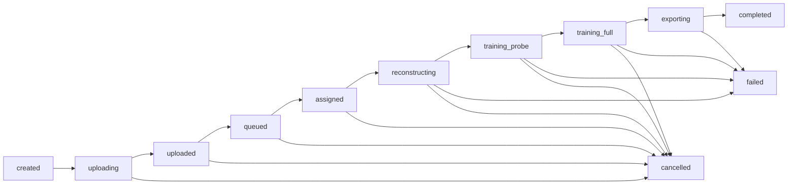

# 控制平面最小版设计稿

## 目标

把当前：

`手机 -> 本机 broker -> 单台 GPU`

升级成：

`手机 -> 常驻控制平面 -> 对象存储 -> GPU worker 池 -> 对象存储 -> 手机`

适用场景：

- 没有自有机器
- GPU 全部是临时租用
- 未来 100 个用户共用 5 到 100 台 GPU

核心原则：

- 手机永远不直连 GPU
- 手机只做后台上传、轮询状态、下载产物
- 控制平面不依赖任何单台 GPU
- worker 主动拉任务，不让控制平面 SSH 推任务
- 所有状态都以 `job_id` 为中心持久化

## 一、系统边界

### 1. 手机端

职责：

- `POST /v1/jobs`
- 获取对象存储上传凭证
- 使用 `URLSessionConfiguration.background` 上传视频
- 调用 `POST /v1/jobs/{job_id}/upload-complete`
- 轮询 `GET /v1/jobs/{job_id}`
- 下载产物 manifest 和最终 viewer 资源

不做：

- 不持有 GPU SSH
- 不知道具体是哪一台 5090
- 不直接知道对象存储内的私有路径

### 2. 控制平面

职责：

- 创建 job
- 生成对象存储上传地址
- 接收上传完成通知
- 维护 job 状态机
- 维护 worker 池
- 调度 worker
- 汇总 runtime / ETA / artifacts
- 向手机输出统一状态 JSON

建议部署：

- 一台廉价常驻后端机，或云容器平台
- 不部署在 GPU worker 上

### 3. 对象存储

职责：

- 存输入视频
- 存预处理缓存
- 存最终产物
- 存 preview / metrics / viewer manifest

推荐布局：

- `uploads/{tenant_id}/{job_id}/input.mov`
- `artifacts/{job_id}/3dgs_final.ply`
- `artifacts/{job_id}/preview.jpg`
- `artifacts/{job_id}/metrics.json`
- `artifacts/{job_id}/viewer_manifest.json`
- `runtime/{job_id}/runtime_status.json`

### 4. GPU worker

职责：

- 启动时注册自己
- 定期发 heartbeat
- 主动拉取一个可执行 job
- 从对象存储拉输入
- 跑 `prep -> probe -> full -> export`
- 持续回传 runtime
- 上传产物
- 上报成功或失败

worker 是临时的，可替换的，死掉后由控制平面回收任务。

## 二、数据库 Schema 草案

建议：`Postgres`

### 1. `tenants`

如果前期只有单租户，也建议先保留 `tenant_id`。

```sql
create table tenants (
  tenant_id uuid primary key,
  name text not null,
  created_at timestamptz not null default now()
);
```

### 2. `users`

```sql
create table users (
  user_id uuid primary key,
  tenant_id uuid not null references tenants(tenant_id),
  external_id text,
  display_name text,
  created_at timestamptz not null default now()
);
```

### 3. `jobs`

主表。所有手机和 worker 都围绕它工作。

```sql
create type job_state as enum (
  'created',
  'uploading',
  'uploaded',
  'queued',
  'assigned',
  'reconstructing',
  'training_probe',
  'training_full',
  'exporting',
  'completed',
  'failed',
  'cancelled'
);

create table jobs (
  job_id text primary key,
  tenant_id uuid not null references tenants(tenant_id),
  user_id uuid references users(user_id),

  client_record_id text,
  capture_origin text not null,

  input_file_name text not null,
  input_content_type text not null,
  input_size_bytes bigint not null,
  input_storage_key text,

  state job_state not null,
  stage text,
  phase_name text,
  current_tier text,
  title text,
  detail text,

  progress_fraction double precision,
  progress_basis text,
  elapsed_seconds integer,
  estimated_remaining_seconds integer,

  assigned_worker_id text,
  worker_generation integer not null default 0,

  artifact_manifest_storage_key text,
  artifact_primary_storage_key text,
  preview_storage_key text,
  metrics_storage_key text,

  failure_reason text,
  failure_detail text,
  retry_count integer not null default 0,

  created_at timestamptz not null default now(),
  updated_at timestamptz not null default now(),
  upload_completed_at timestamptz,
  assigned_at timestamptz,
  started_at timestamptz,
  completed_at timestamptz,
  cancelled_at timestamptz
);

create index jobs_state_created_idx on jobs(state, created_at);
create index jobs_assigned_worker_idx on jobs(assigned_worker_id);
create index jobs_tenant_created_idx on jobs(tenant_id, created_at desc);
```

### 4. `job_events`

事件流，便于审计和恢复。

```sql
create table job_events (
  event_id bigserial primary key,
  job_id text not null references jobs(job_id) on delete cascade,
  event_type text not null,
  payload jsonb not null default '{}'::jsonb,
  created_at timestamptz not null default now()
);

create index job_events_job_created_idx on job_events(job_id, created_at);
```

事件例子：

- `job_created`
- `upload_url_issued`
- `upload_completed`
- `worker_assigned`
- `worker_started`
- `runtime_update`
- `artifact_uploaded`
- `job_completed`
- `job_failed`
- `job_cancel_requested`
- `job_cancelled`

### 5. `workers`

```sql
create type worker_state as enum (
  'registering',
  'idle',
  'busy',
  'draining',
  'offline'
);

create table workers (
  worker_id text primary key,
  provider text not null,
  region text,
  instance_label text,
  host_fingerprint text,

  gpu_model text not null,
  gpu_count integer not null default 1,
  vram_mb integer,
  cpu_cores integer,
  ram_mb integer,
  disk_free_mb integer,

  state worker_state not null,
  current_job_id text,
  current_job_started_at timestamptz,

  software_version text,
  capability_flags jsonb not null default '{}'::jsonb,
  last_heartbeat_at timestamptz,
  created_at timestamptz not null default now(),
  updated_at timestamptz not null default now()
);

create index workers_state_heartbeat_idx on workers(state, last_heartbeat_at);
```

### 6. `worker_heartbeats`

可选，但强烈建议留。

```sql
create table worker_heartbeats (
  heartbeat_id bigserial primary key,
  worker_id text not null references workers(worker_id) on delete cascade,
  state text not null,
  gpu_util double precision,
  gpu_mem_used_mb integer,
  cpu_util double precision,
  disk_free_mb integer,
  payload jsonb not null default '{}'::jsonb,
  created_at timestamptz not null default now()
);

create index worker_heartbeats_worker_created_idx on worker_heartbeats(worker_id, created_at desc);
```

### 7. `artifacts`

```sql
create table artifacts (
  artifact_id bigserial primary key,
  job_id text not null references jobs(job_id) on delete cascade,
  artifact_type text not null,
  storage_key text not null,
  content_type text,
  size_bytes bigint,
  checksum_sha256 text,
  created_at timestamptz not null default now()
);

create index artifacts_job_type_idx on artifacts(job_id, artifact_type);
```

## 三、Worker Agent 协议草案

建议全部走 HTTPS JSON。

### 1. `POST /v1/workers/register`

用途：

- 新租的 5090 启动 agent 后注册自己

请求：

```json
{
  "provider": "vast",
  "region": "eu-west",
  "instance_label": "vast-210779",
  "host_fingerprint": "sha256:...",
  "gpu_model": "RTX 5090",
  "gpu_count": 1,
  "vram_mb": 32607,
  "cpu_cores": 32,
  "ram_mb": 131072,
  "disk_free_mb": 208000,
  "software_version": "worker-2026.03.22",
  "capability_flags": {
    "hislam2": true,
    "3dgs": true,
    "probe_gate": true
  }
}
```

响应：

```json
{
  "worker_id": "worker_vast_210779_01",
  "heartbeat_interval_sec": 15,
  "pull_interval_sec": 5
}
```

### 2. `POST /v1/workers/{worker_id}/heartbeat`

请求：

```json
{
  "state": "idle",
  "gpu_util": 0.0,
  "gpu_mem_used_mb": 0,
  "cpu_util": 18.2,
  "disk_free_mb": 208000,
  "current_job_id": null
}
```

响应：

```json
{
  "ok": true,
  "drain": false
}
```

### 3. `POST /v1/workers/{worker_id}/claim-next`

worker 主动拉任务。

请求：

```json
{
  "max_concurrent_jobs": 1,
  "gpu_model": "RTX 5090",
  "disk_free_mb": 208000
}
```

无任务响应：

```json
{
  "assignment": null
}
```

有任务响应：

```json
{
  "assignment": {
    "job_id": "job_01hq8n6d23y0q6v8x3h2m9wq4b",
    "lease_ttl_sec": 120,
    "input": {
      "storage_key": "uploads/tenant_a/job_.../input.mov",
      "download_url": "https://storage.example.com/...",
      "content_type": "video/quicktime",
      "size_bytes": 1488327217
    },
    "output_prefix": "artifacts/job_01hq8n6d23y0q6v8x3h2m9wq4b/",
    "pipeline_profile": {
      "strategy": "autofallback",
      "max_total_minutes": 40
    }
  }
}
```

### 4. `POST /v1/jobs/{job_id}/runtime`

worker 持续上报 runtime。

请求：

```json
{
  "worker_id": "worker_vast_210779_01",
  "state": "training_probe",
  "stage": "train",
  "phase_name": "probe",
  "current_tier": "official_default",
  "title": "远端正在训练 3D 模型",
  "detail": "official_default_probe 已完成 248 / 900 渲染。",
  "progress_fraction": 0.58,
  "progress_basis": "runtime_render_count",
  "elapsed_seconds": 812,
  "estimated_remaining_seconds": 451,
  "metrics": {
    "current_step": 24000,
    "total_steps": 26000,
    "current_render_count": 248,
    "target_render_count": 900,
    "gaussian_count": 184523
  }
}
```

### 5. `POST /v1/jobs/{job_id}/artifact-manifest`

worker 把产物上传到对象存储后，回传 manifest。

```json
{
  "worker_id": "worker_vast_210779_01",
  "manifest": {
    "primary_artifact": {
      "type": "ply",
      "storage_key": "artifacts/job_.../3dgs_final.ply",
      "size_bytes": 92834444,
      "checksum_sha256": "..."
    },
    "preview": {
      "type": "jpg",
      "storage_key": "artifacts/job_.../preview.jpg"
    },
    "metrics": {
      "type": "json",
      "storage_key": "artifacts/job_.../metrics.json"
    },
    "viewer_manifest": {
      "type": "json",
      "storage_key": "artifacts/job_.../viewer_manifest.json"
    }
  }
}
```

### 6. `POST /v1/jobs/{job_id}/complete`

```json
{
  "worker_id": "worker_vast_210779_01",
  "title": "结果已完成",
  "detail": "最终产物已上传到对象存储，可供手机下载。"
}
```

### 7. `POST /v1/jobs/{job_id}/fail`

```json
{
  "worker_id": "worker_vast_210779_01",
  "failure_reason": "prep_no_matches",
  "failure_detail": "official_default: no images with matches found in the database",
  "stage": "reconstructing",
  "phase_name": "mapper"
}
```

### 8. `POST /v1/jobs/{job_id}/cancel-ack`

worker 收到控制平面取消后，确认本地已经停掉。

## 四、Worker 状态机

### worker 状态

- `registering`
- `idle`
- `busy`
- `draining`
- `offline`

### job 状态

- `created`
- `uploading`
- `uploaded`
- `queued`
- `assigned`
- `reconstructing`
- `training_probe`
- `training_full`
- `exporting`
- `completed`
- `failed`
- `cancelled`

### 状态转换



## 五、iPhone 端控制平面接口定义

### 1. `POST /v1/jobs`

用途：

- 创建 job
- 返回上传初始化路径

请求：

```json
{
  "file_name": "scan.mov",
  "file_size_bytes": 1488327217,
  "content_type": "video/quicktime",
  "capture_origin": "mobile_app",
  "client_record_id": "2C1674D5-7F1D-49AA-8C17-6321E8C1A1F0"
}
```

响应：

```json
{
  "job_id": "job_01hq8n6d23y0q6v8x3h2m9wq4b",
  "state": "created",
  "upload_init_path": "/v1/jobs/job_01hq8n6d23y0q6v8x3h2m9wq4b/upload-init",
  "poll_path": "/v1/jobs/job_01hq8n6d23y0q6v8x3h2m9wq4b",
  "cancel_path": "/v1/jobs/job_01hq8n6d23y0q6v8x3h2m9wq4b"
}
```

### 2. `POST /v1/jobs/{job_id}/upload-init`

用途：

- 返回对象存储预签名 URL

响应：

```json
{
  "upload": {
    "method": "PUT",
    "url": "https://storage.example.com/uploads/tenant/job/input.mov?...",
    "headers": {
      "Content-Type": "video/quicktime"
    }
  }
}
```

### 3. `POST /v1/jobs/{job_id}/upload-complete`

用途：

- iPhone 在 `URLSession background upload` 完成后通知控制平面

请求：

```json
{
  "etag": "\"8f6c...\"",
  "size_bytes": 1488327217
}
```

响应：

```json
{
  "job_id": "job_01hq8n6d23y0q6v8x3h2m9wq4b",
  "state": "queued",
  "title": "视频已上传",
  "detail": "正在排队等待可用 GPU。",
  "progress_fraction": 0.15
}
```

### 4. `GET /v1/jobs/{job_id}`

用途：

- 手机轮询统一状态

响应：

```json
{
  "job_id": "job_01hq8n6d23y0q6v8x3h2m9wq4b",
  "state": "training_probe",
  "title": "远端正在训练 3D 模型",
  "detail": "official_default_probe 已完成 248 / 900 渲染。",
  "progress_fraction": 0.58,
  "progress_basis": "runtime_render_count",
  "elapsed_seconds": 812,
  "estimated_remaining_seconds": 451,
  "failure_reason": null,
  "artifact": null
}
```

完成态：

```json
{
  "job_id": "job_01hq8n6d23y0q6v8x3h2m9wq4b",
  "state": "completed",
  "title": "结果已完成",
  "detail": "3DGS 已生成，可下载查看。",
  "progress_fraction": 1.0,
  "progress_basis": "completed",
  "elapsed_seconds": 1410,
  "estimated_remaining_seconds": 0,
  "artifact": {
    "manifest_url": "https://api.example.com/v1/jobs/job_.../artifact-manifest",
    "primary_download_url": "https://storage.example.com/artifacts/job_.../3dgs_final.ply?...",
    "preview_url": "https://storage.example.com/artifacts/job_.../preview.jpg?..."
  }
}
```

### 5. `DELETE /v1/jobs/{job_id}`

用途：

- 用户取消任务
- 控制平面将 job 标记 `cancelled`
- 若已分配 worker，则下发取消请求

### 6. `GET /v1/jobs/{job_id}/artifact-manifest`

用途：

- 手机拿 viewer 下载清单

## 六、状态与 ETA 设计

### 1. 手机显示原则

- 上传阶段：按字节 / 实际吞吐显示 ETA
- 排队阶段：按前面队列长度和历史平均耗时显示 ETA
- prep 阶段：按真实 work unit 估时
- train 阶段：按真实 step / render_count 估时
- 若缺少硬指标：宁可不显示 ETA，也不要显示拍脑袋的固定分钟数

### 2. worker 必须上报的最小硬指标

#### prep

- `current_frame_count`
- `selected_frame_count`
- `matched_pair_count`
- `target_match_pair_count`
- `registered_image_count`
- `target_registered_image_count`

#### probe/train

- `current_step`
- `total_steps`
- `current_render_count`
- `target_render_count`
- `current_gaussian_count`
- `throughput_steps_per_sec`

### 3. 控制平面 ETA 策略

- 若 worker 已给 `estimated_remaining_seconds`，直接信任
- 若没有，则按 `progress_basis` 做有条件推算
- 若 basis 不可靠，返回 `null`

## 七、调度策略草案

### 1. 当前版本建议

- 一机一任务
- 仅调度：
  - `state = idle`
  - `disk_free_mb > threshold`
  - `last_heartbeat_at < 30 sec`
  - `gpu_model in allowed_set`

### 2. 选 worker 规则

按优先级排序：

1. 健康度高
2. 最近成功率高
3. 磁盘空余高
4. 区域更近
5. 同 provider 资源更稳定

### 3. 超时和回收

- `worker heartbeat` 超过 `30 sec` 未更新：标记 `offline`
- `job assigned` 超过 `lease_ttl_sec` 未有 runtime：回队
- `runtime_status` 超过阈值不更新，且无活 worker：标记 `failed(worker_stalled_or_runtime_stale)`

## 八、租用 GPU 的实际运维建议

因为 GPU 都是租的，所以：

- 控制平面不能部署在 GPU 上
- worker agent 要支持：
  - 一键 bootstrap
  - 断线自动重连
  - 注册失败自动退避
  - 本地磁盘清理
  - 任务结束自动上传 artifacts

建议每台租来的 GPU 启动后执行：

1. 安装 worker runtime
2. 拉取最新 pipeline 镜像或代码
3. 注册到控制平面
4. 进入 `idle`
5. 开始 pull job

## 九、最小落地顺序

### Phase 1

- `jobs`
- `upload-init`
- `upload-complete`
- `status`
- `cancel`
- `workers/register`
- `workers/heartbeat`
- `workers/claim-next`
- `jobs/runtime`
- `jobs/fail`
- `jobs/complete`

### Phase 2

- artifact manifest
- 真 ETA
- 队列 ETA
- worker 失败重排

### Phase 3

- 多租户
- 多区域调度
- 自动扩容
- 成本优化

## 十、当前和目标的区别

当前原型：

- 手机 -> 本机 broker -> 丹麦机
- 仍然依赖一台本地电脑常开

目标控制平面：

- 手机 -> 常驻控制平面 -> 对象存储 -> worker 池
- 不依赖你的 Mac
- 不绑定任何单台 5090

这才适合：

- 100 用户
- 5 到 100 台租来的 GPU
- 动态加机器、删机器、换 provider
